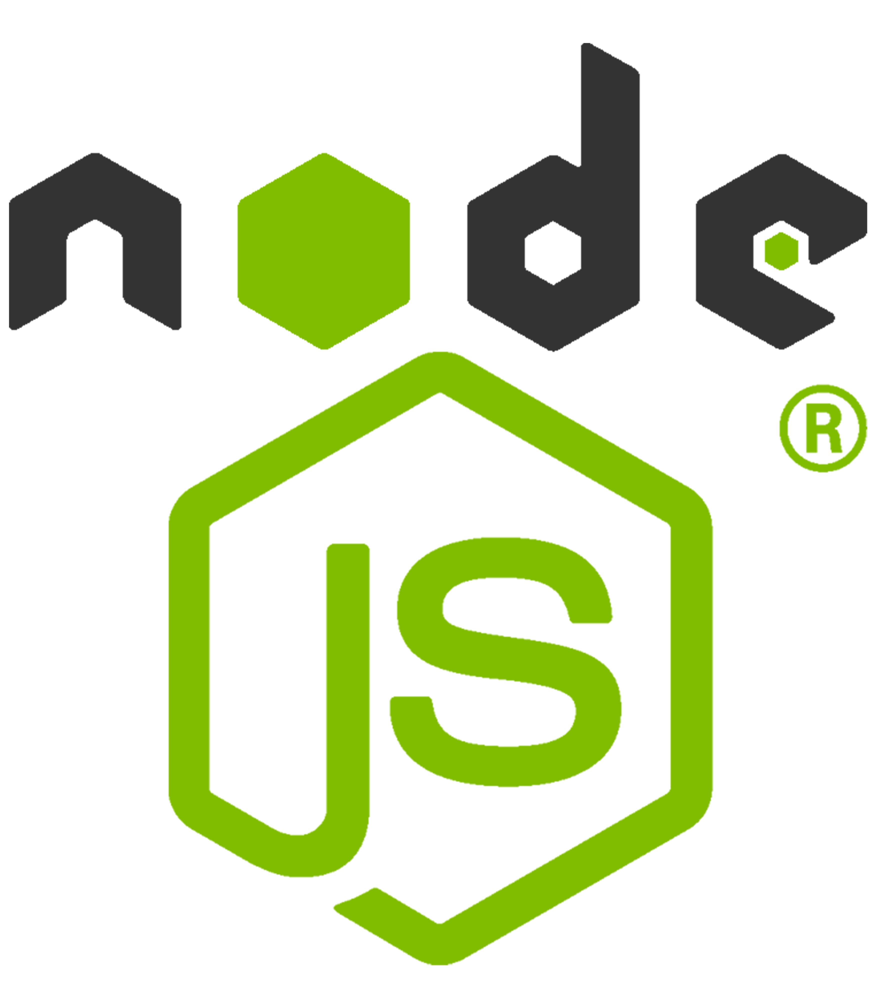

### Hello there! 

- 🔭 I’m currently working on improving my [Workout Planning App](https://github.com/aaronjunehee/workout-log)
- 🌱 I’m currently learning React, Node.js and Mongoose/MongoDB
- 📫 How to reach me: You can email me at aaronjunehee (at) gmail.com
- 😄 Pronouns: He/Him

### Languages and Tools 👋

